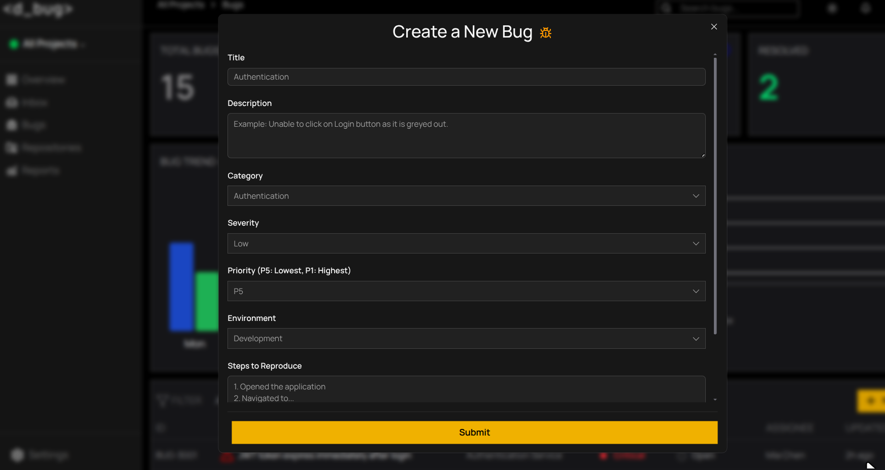
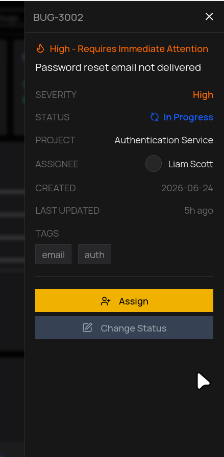
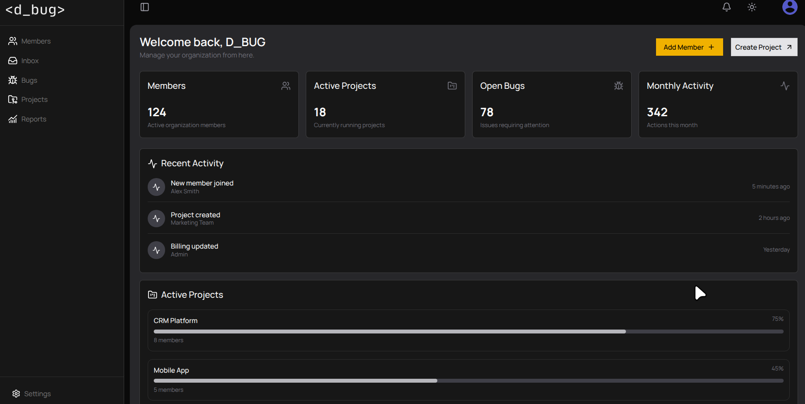
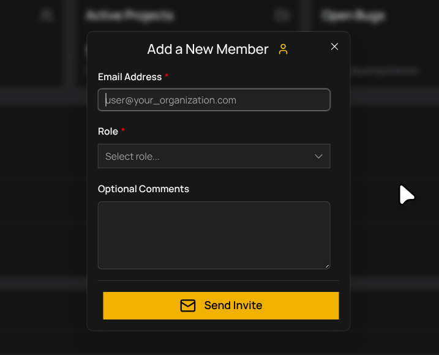

# d_bug

**d_bug is a lightweight AI-assisted bug triage and team collaboration platform built for small engineering teams and startups.**

It helps teams collect, organize, review, and manage software bugs through a structured triage workflow. 

The goal is to reduce the overhead involved in understanding incoming issues, assigning ownership and maintaining visibility across engineering teams.

d_bug combines a modern React frontend with a FastAPI backend and provides organization management, role-based access control, project-based bug tracking and AI-assisted workflows for future triage automation.

## Tech Stack

* **Frontend:** React, JavaScript, Vite, Tailwind CSS, shadcn/ui, toast notifications, Tanstack Query
* **Backend:** FastAPI, Python, SQLAlchemy
* **Database:** Neon PostgreSQL
* **Authentication & Authorization:** - JWT Authentication, pwdlib password hashing, Role-Based Access Control (RBAC)
* **AI:** OpenAI API, OpenRouter
* **Background Processing:** Dramatiq workers for asynchronous tasks
* **Observability (Planned):** Prometheus (for metrics), Grafana dashboards(monitoring and performance tracking)

## Features

### Organization & Team Management

- JWT-based authentication
- Organization workspaces
- Team invitations
- Role-based access control (RBAC)
- Permission-based authorization

### Project Management

- Create and manage projects
- Associate bugs with projects
- Connect repositories with projects

### Bug Management & Triage

- Create and manage bug reports
- Track bug status, severity, priority and ownership
- Review incoming bug changes
- Organize bugs through a structured workflow

### AI-Assisted Triage

AI features are being developed to assist with:

- Bug categorization
- Duplicate bug detection
- Bug description analysis
- Triage recommendations

The goal is to assist engineers during triage, not replace the decision-making process.

## Getting Started

### Backend

```bash
cd backend
pip install -r requirements.txt
uvicorn app.main:app --reload
```

### Frontend

```bash
cd frontend
npm install
npm run dev
```

## Environment Variables

Create a `.env` file in the backend:

```env
DATABASE_URL=your_neon_database_url
OPENAI_API_KEY=your_openai_api_key
JWT_SECRET_KEY=your_secret_key
```

# Project Status

d_bug is actively being developed as a production-oriented lightweight bug triage platform.

The focus is on building a practical tool for small engineering teams that need better visibility and automation around incoming bugs without the complexity of large enterprise systems.

The current development focus is:

- Completing organization-level Role-Based Access Control (RBAC)
- Improving bug creation and management workflows
- Building AI-assisted triage workflows
- Strengthening collaboration features and backend infrastructure

The goal is to build a production-ready foundation for teams that need a simple and efficient way to manage software bugs from submission through resolution.

---

## Preview

### Authentication

#### Sign Up


#### Sign In


#### Hero Section


#### Onboarding


#### Dashboard


#### Create a new Bug manually



#### View Bug Details



##### Organization Dashboard



#### Add a New Member


