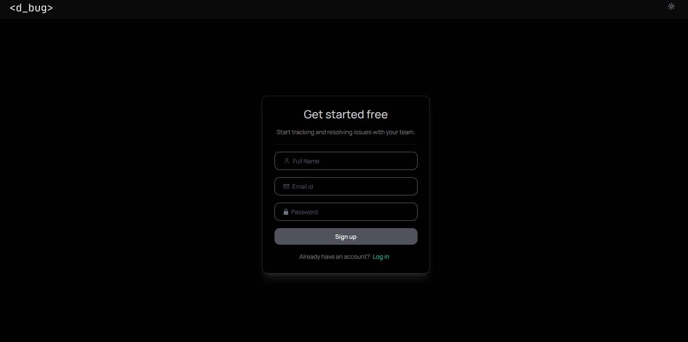
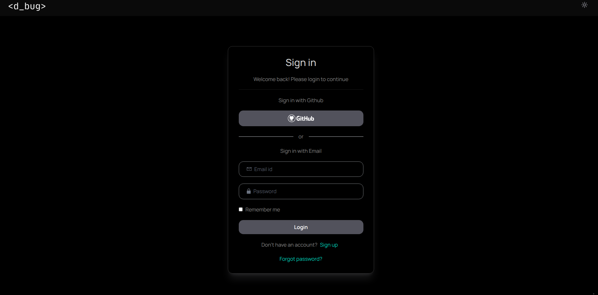
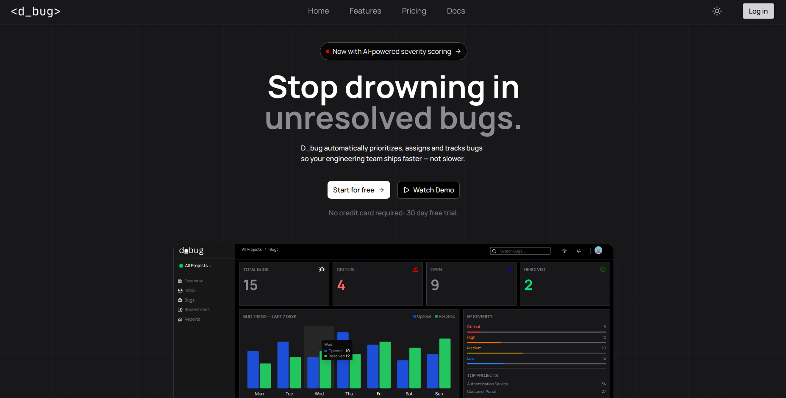
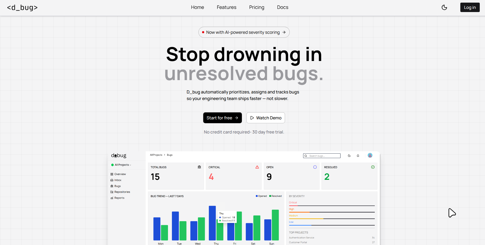
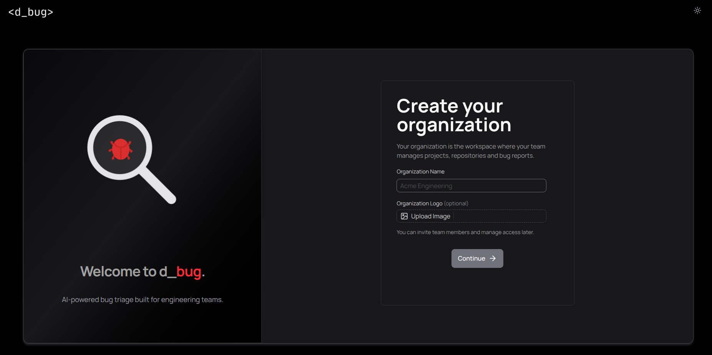
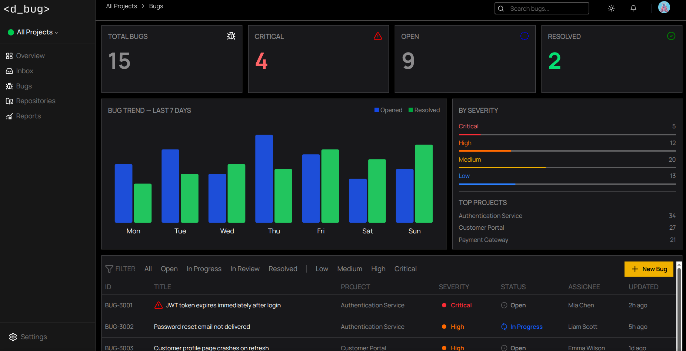

# d_bug

An AI-powered bug triage platform built as a portfolio project to explore how LLMs can improve bug management workflows. 

It combines a modern React frontend with a FastAPI backend and uses the OpenAI API to assist with bug categorization and duplicate detection.

## Tech Stack

* **Frontend:** React, JavaScript, Vite, Tailwind CSS, shadcn/ui, Toaster
* **Backend:** FastAPI, Python, SQLAlchemy
* **Database:** Neon PostgreSQL
* **Authentication:** PyJWT, pwdlib
* **AI:** OpenAI API

## Features

### Authentication & Organizations

* Secure JWT authentication
* Create and manage organizations
* Organization creator automatically assigned the **Admin** role
* Invite team members and manage roles (Admin, Developer, etc.)

### Project Management

* Create projects manually
* Connect GitHub repositories to projects

### Bug Management

* View and manage bugs from a centralized dashboard
* Update bug status, priority, severity and assignee
* Support for a complete bug triage workflow

### Review Inbox

* Review incoming bug changes
* Approve or reject bugs awaiting review

### AI-Assisted Triage (to be added)

* Automatic bug categorization
* Duplicate bug detection using the OpenAI API
* AI-assisted bug analysis (work in progress)

## Getting Started

### Backend

```bash
cd backend
pip install -r requirements.txt
uvicorn app.main:app --reload
```

### Frontend

```bash
cd frontend
npm install
npm run dev
```

## Environment Variables

Create a `.env` file in the backend:

```env
DATABASE_URL=your_neon_database_url
OPENAI_API_KEY=your_openai_api_key
JWT_SECRET_KEY=your_secret_key
```

## Project Status

This project is actively being developed as a portfolio project to demonstrate full-stack application development, authentication, role-based access control, AI integration and modern bug management workflows.

## Preview

### Authentication

#### Sign Up Dark



#### Sign In



#### Hero Section





#### Onboarding



#### Dashboard


